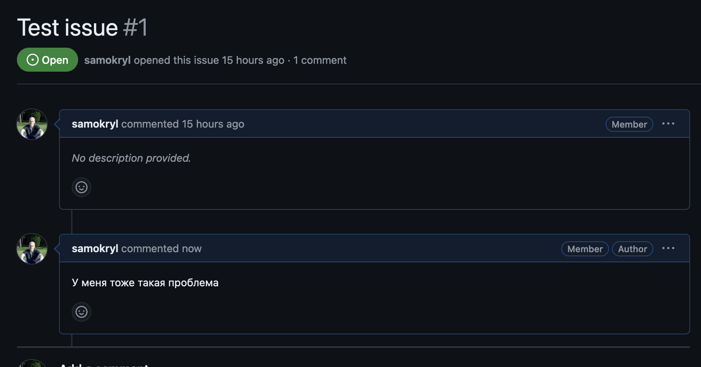

# The Jammers Beta

## Инструкция по включению в программу бета-тестирования
В заявке Вы указывали свой адрес почты, привязанной к GooglePlay-акканту.
Этот адрес будет добавлен в группу бета-тестирования.

Вам необходимо открыть в **браузере** [ссылку](https://play.google.com/apps/internaltest/4701741357009322935) и подтвердить своё участие.

Теперь Вы можете скачать последнюю бета-версию по  [ссылке 1](https://play.google.com/store/apps/details?id=music.jammers.client&hl=en-US&ah=KWRM8BI4AYrdW-JRxxewEYB8X-E)

Вы можете покинуть программу тестирования в любой момент. Для этого нажмите `LEAVE THE PROGRAM` `кнопка 2`

## Инструкция по заведению задач
Вам необходим акканунт на https://github.com  
Список задач доступен по [ссылке](https://github.com/LimaSoulMusic/TheJammersBeta/issues)

Перед заведением новой задачи просмотрите текущий список, возможно кто-то уже сообщил о подобной проблеме.
Можно добавлять комментарии к текущим задачам.

Добавить новую задачу можно через кнопку `New issue`
Вы можете добавить два типа задач `Ошибка` или `Улучшение`

Заводим ошибку, если приложение работает не так, как Вы ожидали).

Заводим улучшение, если у вас есть предложение по улучшению работы приложения.  

